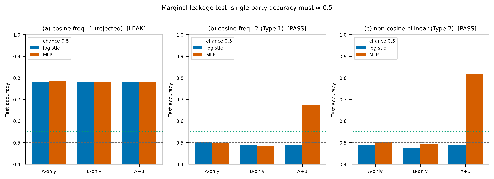
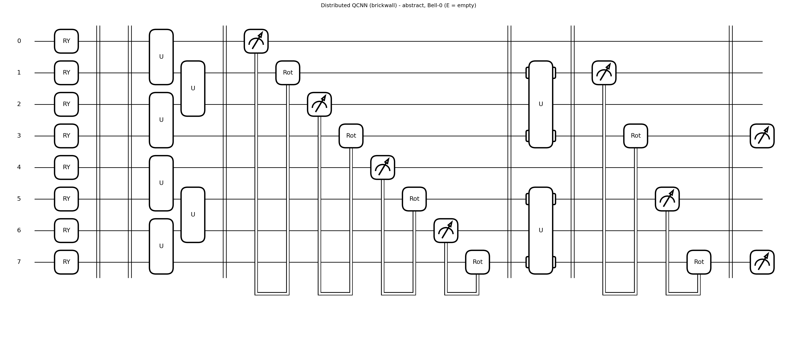
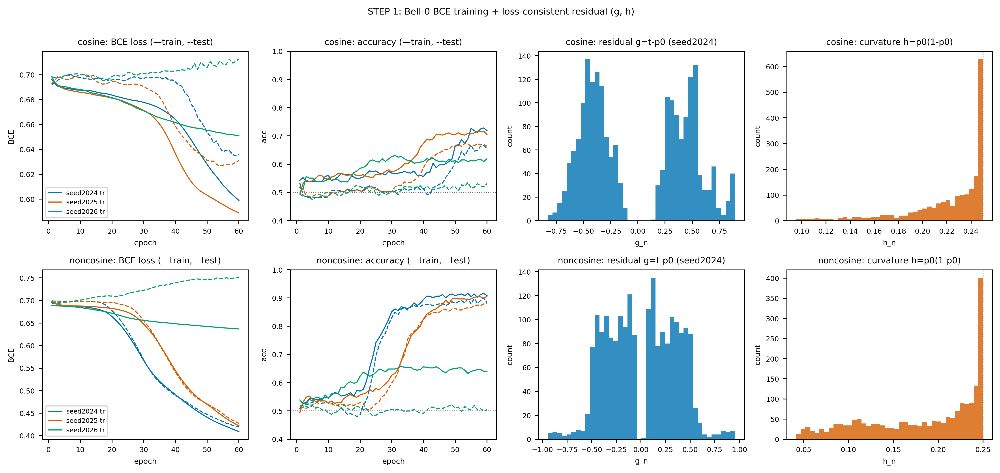
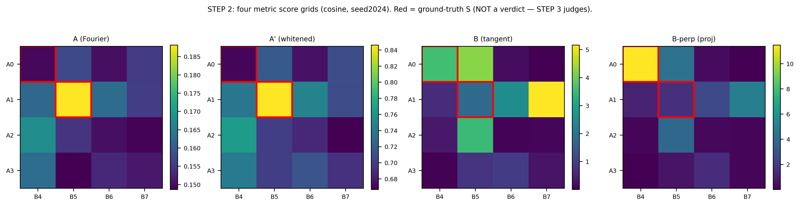

# 양자양자: Distributed QML을 위한 데이터 기반 얽힘 진단 (CPFP)

📢 2026년 1학기 [AIKU](https://github.com/AIKU-Official) 활동으로 진행한 프로젝트입니다

## 소개

여러 대의 양자 컴퓨터(QPU)를 연결해 더 큰 문제를 풀려는 **분산 양자 머신러닝(Distributed Quantum Machine Learning, DQML)** 에서는, 서로 다른 QPU에 나뉘어 올라간 데이터를 어떻게 결합할지가 핵심 과제입니다. 두 QPU 사이를 **얽힘(entanglement)** 으로 연결하면 직접 데이터를 주고받지 않아도 결합된 정보를 만들 수 있지만, 얽힘은 비싼 자원이라 **아무 데나 많이 거는 것**은 비효율적입니다.

저희 프로젝트는 다음 질문에 답하려 합니다.

> **"두 QPU에 데이터를 나눠 학습할 때, 어떤 큐비트 쌍을 얽어야 하는가? 그리고 그것을 데이터로부터 미리 알 수 있는가?"**

이를 위해 저희는 **CPFP (Cross-Party Fourier Power)** 라는 진단 방법론을 제안합니다. 핵심 아이디어는, 얽힘 없이 학습한 baseline 모델이 **무엇을 못 풀었는지(residual)** 를 분석해, 그 못 푼 부분이 어느 큐비트 쌍의 결합과 관련 있는지를 찾아내고, 거기에만 얽힘을 처방하는 것입니다.

## 방법론

### 문제 설정

8차원 데이터를 두 party로 나눕니다. Party A는 feature `[0,1,2,3]`, Party B는 feature `[4,5,6,7]`를 받아 각자 **로컬 양자 회로(Distributed QCNN)** 로 처리하고, 두 party의 readout을 고전 가중치로 결합해 예측합니다. Party 사이에는 직접 게이트나 통신이 없고, **미리 공유한 얽힘(pre-shared entanglement)** 만 허용합니다.

### CPFP 진단 파이프라인

1. **Bell-0 baseline 학습** — 얽힘이 전혀 없는(`E=∅`) 분산 모델을 BCE loss로 학습합니다.
2. **Loss-consistent residual 계산** — 학습된 모델의 logit `z₀`에 대해 `g = t − σ(z₀)` 를 계산합니다. 이것이 "baseline이 설명하지 못한 부분"입니다.
3. **Cross-power 행렬 M 계산** — residual `g`가 각 큐비트 쌍 `(i,j)`의 cross feature와 얼마나 정렬되는지를 측정해 `M_ij` 를 만듭니다. 값이 클수록 그 쌍의 결합이 라벨 설명에 중요하다는 뜻입니다.
4. **통계적 임계값 (label-shuffle null)** — 라벨을 무작위로 섞은 데이터에서 같은 계산을 반복해 null 분포를 만들고, 그 위로 유의하게 솟은 쌍만 "얽어야 할 쌍"으로 선택합니다.

### 진단 메트릭 비교 (이 프로젝트의 핵심)

단순 상관(correlation) 기반 메트릭은 "데이터에 상관이 있다"만 볼 뿐, 그 정보가 실제 회로에서 readout까지 전달되는지를 모릅니다. 그래서 저희는 4가지 메트릭을 같은 조건에서 비교합니다.

| 메트릭 | 정의 | 특징 |
|--------|------|------|
| **A (Fourier)** | `M_ij = ‖B_ij‖_F` (Walsh–Fourier cross-power) | 기존 baseline. 데이터 상관만 봄 |
| **A' (whitened)** | 가중 whitening 후 cross-power | 색 분포 불균형으로 생기는 가짜 신호 제거 |
| **B (tangent)** | `(gᵀuₑ)² / (uₑᵀHuₑ + λ)`, `uₑ = ∂z/∂θₑ` | 실제 얽힘을 켰을 때 logit 변화를 봄 (회로 인지적) |
| **B⊥ (projection)** | Bell-0가 표현 가능한 부분공간을 제거한 tangent | Bell만이 만들 수 있는 방향만 남김 |

메트릭 **B/B⊥** 는 pooling에서 사라지는 큐비트, readout까지의 거리, 라우팅을 자동으로 반영한다는 점에서 단순 상관 메트릭과 본질적으로 다릅니다.

## 환경 설정

```
Python 3.10+
PennyLane == 0.42.0
numpy == 1.26.4
autoray == 0.6.12
matplotlib
scikit-learn
```

```bash
pip install -r requirements.txt
```

양자 회로는 PennyLane의 `default.qubit` 시뮬레이터와 autograd 백엔드(backprop)를 사용합니다.

## 사용 방법

### 1. 데이터 생성 (marginal leakage 없는 합성 데이터)

한쪽 party만으로는 라벨을 예측할 수 없고, 양쪽을 결합해야만 풀 수 있는 합성 데이터를 생성합니다. (cosine cross / non-cosine bilinear 두 종류)

```bash
python src/data_gen.py
```

### 2. Bell-0 baseline 학습 + residual

```bash
python src/train_bell0.py
```

### 3. CPFP 메트릭 계산 (A / A' / B / B⊥)

```bash
python src/metrics.py
```

### 회로 구조 시각화

```bash
python src/circuit.py   # abstract / raw 회로도 + U block 정의 출력
```

## 예시 결과

### 합성 데이터의 타당성 (marginal leakage 검정)

한쪽 party만으로 학습한 분류기는 chance(0.5) 수준이고, 양쪽을 결합했을 때만 정확도가 오릅니다. 특히 **선형 분류기(logistic)는 결합해도 못 풀고 비선형(MLP)만 푼다**는 점에서, 데이터에 단순 더하기가 아닌 진짜 cross 구조가 존재함을 확인했습니다.



### Distributed QCNN 회로 구조

8 큐비트(A: 0–3, B: 4–7), Ry 인코딩 → 얽힘 자리(pre-shared Bell) → brickwall conv(U) + conditional pooling → readout(3, 7) → 고전 결합.



### Bell-0 baseline 학습

얽힘 없는 baseline이 non-cosine 데이터에서 약 0.88, cosine 데이터에서 약 0.66의 정확도를 달성했습니다. (classical MLP와 매칭/초과)



### 4가지 메트릭의 진단 결과

같은 데이터(ground-truth 큐비트 쌍을 아는 합성 데이터)에서 4가지 메트릭이 각 큐비트 쌍에 부여한 점수입니다. 메트릭마다 서로 다른 쌍을 지목하며, 어느 메트릭이 실제로 옳은 처방을 주는지는 현재 검증(ablation) 단계에서 평가 중입니다.



> **현재 진행 상황:** 데이터 생성 · Bell-0 학습 · 4가지 메트릭 구현 및 미분 가능성 검증까지 완료되었으며, 메트릭별 처방을 실제 회로에 적용해 정확도 이득을 비교하는 ablation(다중 seed) 검증을 진행 중입니다.

## 팀원

- **박주현** (팀장) [(github link)](): 프로젝트 총괄, 가설 제안 및 이론 정립, 실험 설계 및 검증
- **장서현** [(github link)](): 이론 정식화, 수학적 프레임워크 구성, 파이프라인 도식화
- **박서연** [(github link)](): 데이터셋 설계 및 제작 (검증용 toy dataset 설계)
